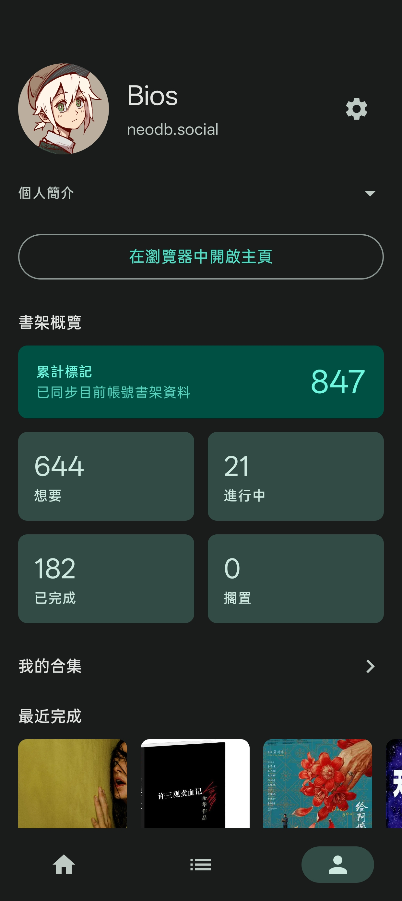
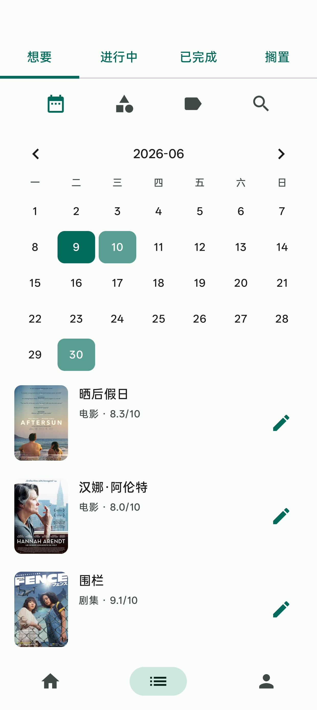
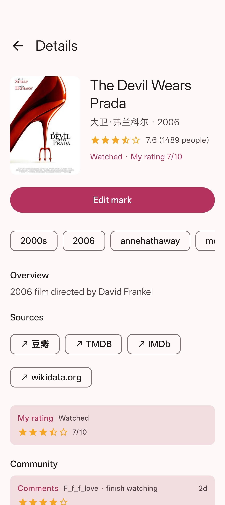
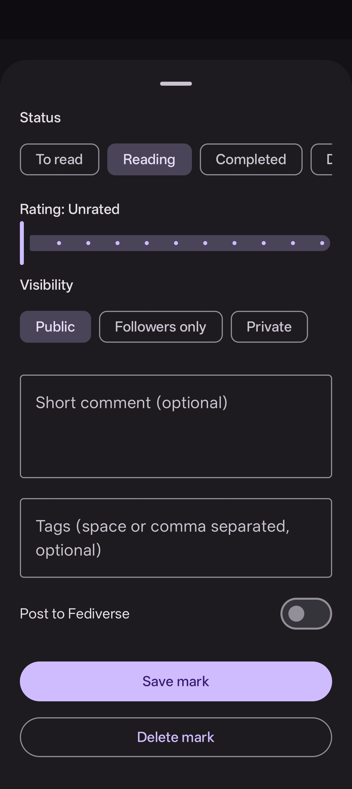

# NeoDBLite

  

  <strong>NeoDB Lite</strong> 
  面向 NeoDB 与兼容实例的非官方 Android 标记客户端

  <a href="README.md">简体中文</a> ·
  <a href="README.zh-TW.md">繁體中文</a> ·
  <a href="README.ja.md">日本語</a> ·
  <a href="README.en.md">English</a>

## 项目简介

NeoDB Lite 是面向 [NeoDB](https://neodb.social) 及兼容实例的非官方 Android 客户端，用于在手机上浏览、搜索和标记书影音游等条目。

## 功能概览

### 浏览 / 发现

- 实例登录：支持填写 NeoDB 实例域名，并通过 OAuth 授权登录。
- 发现浏览：按图书、电影、剧集、音乐、游戏、播客和演出查看趋势内容。
- 条目搜索：支持跨类目搜索，也可以限定类目搜索并分页加载结果。
- 条目详情：展示封面、标题、评分、简介、标签和当前账号的标记状态。
- 社群内容：在条目详情中查看公开短评、评论、笔记等社群内容，并可跳转网页端查看更多。

### 标记管理

- 标记管理：支持设置想读/在读/读过等书架状态、0 到 10 评分、短评和可见性，也支持修改与删除标记。
- 我的书架：按书架状态分页查看自己的标记，可按类目筛选，并支持日历视图辅助回顾。
- 个人主页：展示账号信息、书架概览、最近完成条目和常用设置入口。

### 辅助设置

- 主题切换：支持多套主题配色切换。
- 语言切换：支持简体中文、繁體中文、日本語和 English 界面。
- 应用更新：启动时自动检查新版本（可在设置页关闭），支持应用内下载、调起系统安装器、下载失败重试与手动下载入口。

## 界面预览

  
  
  
  
  

## 使用方式

### 安装使用

从 [Releases](https://github.com/KrelinnBios/NeoDBLite/releases) 下载 APK 后安装。

### 系统要求

Android 7.0（API 24）及以上。

### 更新方式

应用启动时会通过 GitHub Releases API 静默检查新版本（可在设置页关闭自动检查），也可以在设置页手动检查更新。检测到更新后弹出对话框，显示新版本号和发布说明，提供「手动下载」「稍后」和「下载并安装」三个选项。

下载过程中显示进度条、百分比和来源信息（支持 GitHub 直链与镜像回退）。下载完成后自动校验 APK 版本与签名，校验通过后调起系统安装器。若下载或安装失败，对话框会显示错误原因并允许重试。

若当前安装包与 Releases 包签名不一致，系统安装器会拒绝覆盖安装，需要先卸载旧版后重新安装。

## 技术信息

- 技术栈：Kotlin、Jetpack Compose、Material 3、Retrofit、OkHttp。
- 授权方式：使用 Mastodon 兼容的 OAuth 授权码流程连接 NeoDB 实例。
- 更新机制：通过 GitHub Releases API 检查版本，并对下载到的 APK 做版本与签名校验。

## 内容边界

- 本项目为非官方客户端，与 NeoDB 项目及各实例运营方无隶属关系。
- 请遵守所登录实例的服务规则、内容规范和所在地法律法规。
- 条目数据、封面图片、评分、短评和社群内容来自 NeoDB 或对应兼容实例，版权与内容责任归其原始来源所有。
- 访问令牌仅用于当前应用访问所登录实例；请不要安装来源不明的改包版本。

## 许可协议

本项目依据 [MIT License](./LICENSE) 发布。

第三方库、平台内容与外部服务以其原作者、项目或服务的许可与使用条款为准。

## 反馈与贡献

欢迎通过 [GitHub Issue](https://github.com/KrelinnBios/NeoDBLite/issues) 提交使用问题、兼容性问题、功能建议或其他改进建议。
