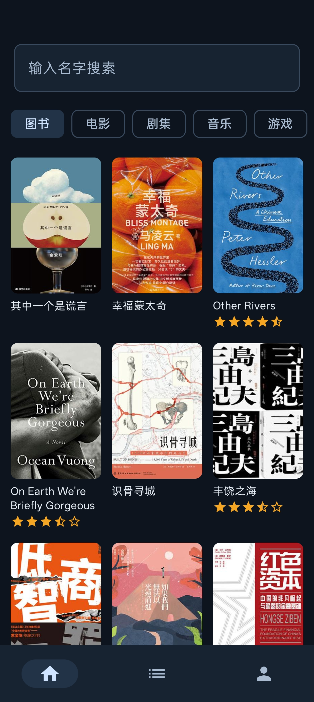
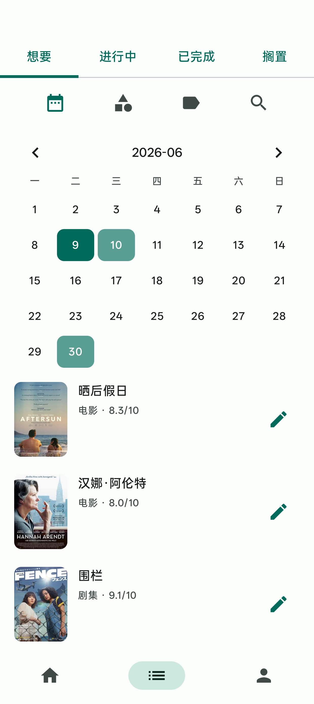
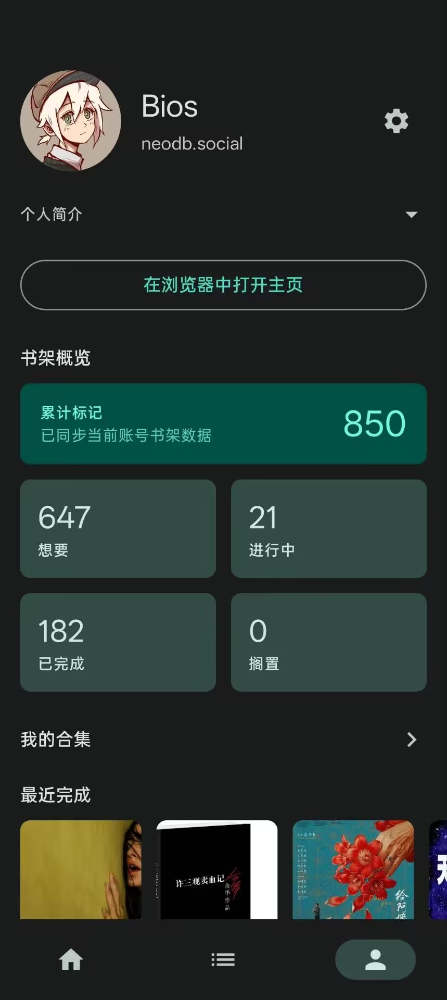
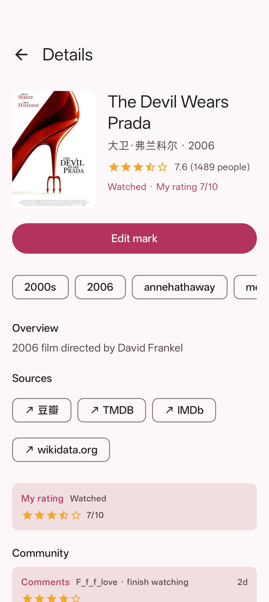
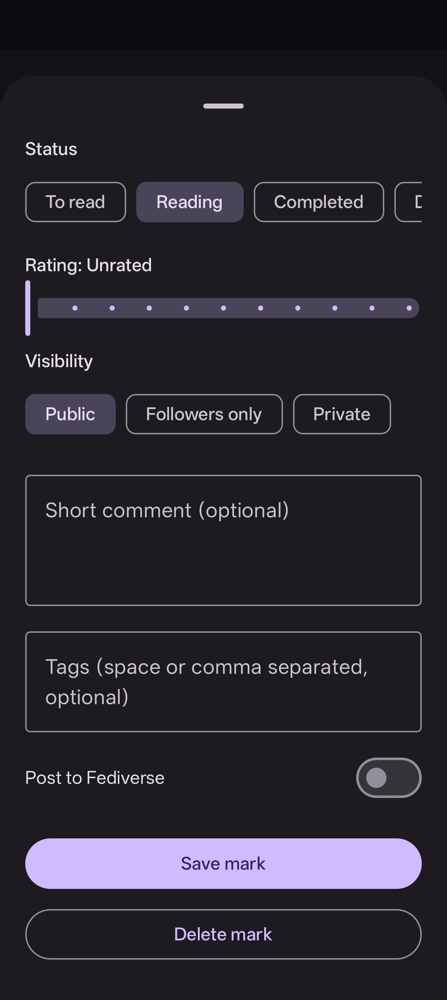

# NeoDBLite

  

  <strong>NeoDB Lite</strong> 
  面向 NeoDB 與相容實例的非官方 Android 標記客戶端

  
  
  

  <a href="README.md">简体中文</a> ·
  <a href="README.zh-TW.md">繁體中文</a> ·
  <a href="README.en.md">English</a>

## 專案簡介

NeoDB Lite 是面向 [NeoDB](https://neodb.social) 及相容實例的非官方 Android 客戶端，用於在手機上瀏覽、搜尋和標記書影音遊等條目。以下說明僅涵蓋 NeoDB Lite 目前公開提供的功能。

## 功能概覽

- 實例登入：填寫 NeoDB 實例域名，透過瀏覽器完成授權登入。
- 發現瀏覽：按類目瀏覽書影音遊等趨勢內容，長按條目可快速標記。
- 條目搜尋：支援跨類目或限定類目搜尋，並保留最近搜尋紀錄。
- 條目詳情：查看封面、簡介、標籤、外部連結、評分與社群內容。
- 條目標記：設定書架狀態、評分、短評、標籤與可見性。
- 我的書架：按狀態、類目、標籤或關鍵字篩選，支援修改、刪除和日曆檢視。
- 個人主頁：查看個人資料、書架統計、最近完成條目與收藏單。
- 個性設定：切換主題和介面語言，檢查更新或登出。

## 介面預覽

  
  
  
  
  

## 使用方式

### 安裝使用

從 [Releases](https://github.com/KrelinnBios/NeoDBLite/releases) 下載 `NeoDB-Lite.apk` 後安裝。

### 系統需求

Android 7.0（API 24）及以上。

目前 APK 僅提供 `arm64-v8a` 和 `armeabi-v7a` 架構版本。

### 更新方式

應用可在啟動時或設定頁檢查新版本。偵測到更新後，可以在應用內下載並安裝，也可以前往 Releases 頁面手動下載。

若系統提示無法覆蓋安裝，通常需要先解除安裝舊版，再從 Releases 重新安裝。

## 隱私與資料

- 登入授權只用於存取所選擇的 NeoDB 或相容實例，登入狀態保存在裝置本機。
- 條目資料、封面、評分和評論來自所登入實例及其關聯來源。
- 請只從本倉庫 Releases 或可信來源安裝 APK，避免使用來源不明的改包版本。

## 內容邊界

- 本專案為非官方客戶端，與 NeoDB 專案及各實例營運方無隸屬關係。
- 請遵守所登入實例的服務規則、內容規範和所在地法律法規。
- 平台內容分別適用相應實例、內容提供者與權利人的條款、隱私政策及權利聲明。

## 授權條款

本專案依據 [MIT License](./LICENSE) 發布，允許使用、修改、散布及商業使用，但須保留授權條款與著作權聲明。

第三方軟體、內容與外部服務不會僅因本專案引用、存取、編譯或展示而自動納入 MIT 授權；實例回傳的資料和帳戶內容也不屬於本專案自身程式碼，詳見 [THIRD-PARTY-NOTICES.md](./THIRD-PARTY-NOTICES.md)。

## 回饋與貢獻

歡迎透過 [GitHub Issue](https://github.com/KrelinnBios/NeoDBLite/issues) 提交使用問題、相容性問題、功能建議或其他改進建議。
